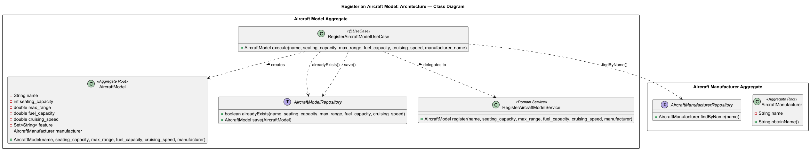
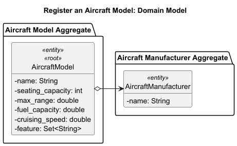
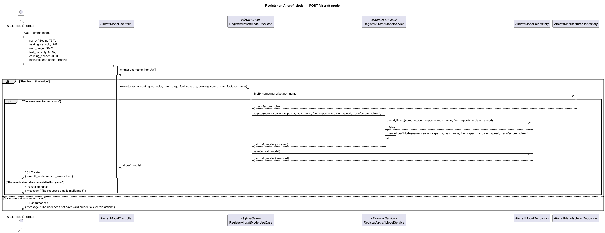

# US101 - Register an Aircraft Model

## User Story Description

_As a Backoffice Operator, I want to register an aircraft model with specifications including manufacturer, model
name, seating capacity, fuel capacity, maximum range, and cruising speed._

## Customer Specifications and Clarifications

> Q: A US101 refere que que o Aircraft Model tem uma "seating capacity". Mas a US203 diz: "The same airplane model can have different seat configuration, and therefore different capacities." Neste sentido, relativamente à capacidade de passageiros, se diferentes aviões do mesmo modelo podem ter capacidades diferentes (US203), a capacidade de lugares deve ser registada ao nível da Instância da Aeronave (Aircraft) em vez de (ou em adição a) ser registada no Modelo da Aeronave (US101)? Ou devemos criar um Modelo de Aeronave diferente para cada configuração de lugares?
> 
>A: Aviões, mesmo sendo do mesmo modelo, podem ter capacidades diferentes.

> Q: We understand that specific aircrafts of the same model can have different seat configurations. Because of this, the seating capacity will be registered individually for each aircraft. However, regarding the creation of the Aircraft Model itself (US101), should the model define a "maximum possible seating capacity"? We are wondering if this is needed to prevent data entry errors (e.g.: if an Operator registers a specific aircraft, should the system verify that the entered seats do not exceed the absolute maximum structural limit defined by that aircraft's model? Or should we assume any number entered by the operator is valid?
> 
> A: Yes. The seating capacity defined in the Aircraft Model represents the maximum structural capacity. This should be used to validate seating configurations.

> Q: Regarding the registration of an aircraft model (US101), we need to specify its manufacturer.
> Could you clarify how these manufacturers should be handled?
> 1. Are the manufacturers just simple text names that the Backoffice Operator types in when creating the model?
> 2. Does AISafe need to maintain a separate, controlled list of manufacturers in the system, storing extra details about them (such as contact information, origin, or a unique identifier) before an aircraft model can be linked to them?
> 3. Are there specific pre-defined manufacturers that exist in this system, or is this list completely open-ended and created on the fly?
>
> A: We will not manage different manufacturers in the application. Manufacturers should come from a fixed list, either by configuration or in each version of the application.

## Class Diagram

## Domain Model

## Sequence Diagram

## OpenAPI Specification
The OpenAPI Specification is present in [US101.yaml](US101.yaml)