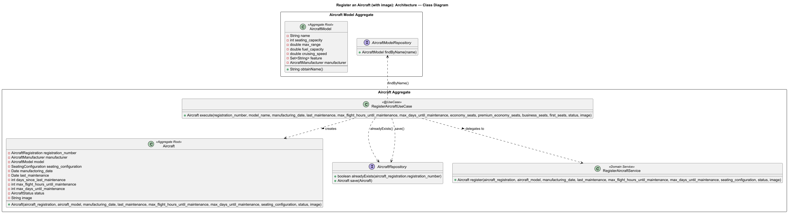
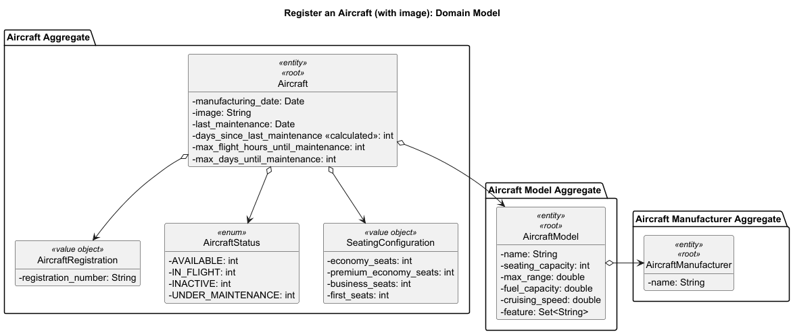
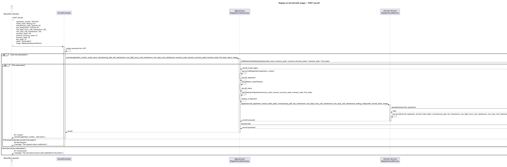

# US202 - Register an Aircraft (with image)

## User Story Description

_As a Backoffice Operator, I want to register an aircraft model with an optional image or technical diagram._

## Customer Specifications and Clarifications

> Q: Regarding US202 (registering an aircraft model with an optional image), we want to make sure we provide the right workflow for the Backoffice Operator. When the operator is adding this image, how do you expect them to do it?
> 1. Should they simply paste a web link of an image that already exists somewhere on the internet?
> 2. Or should they be able to upload an actual image file directly from their own computer into the system?
>
> A: I believe 2 would be better. Thanks.

## Class Diagram

## Domain Model

## Sequence Diagram

## OpenAPI Specification
The OpenAPI Specification is present in [US202.yaml](US202.yaml)