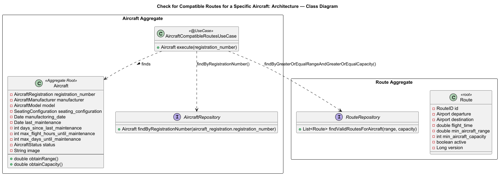
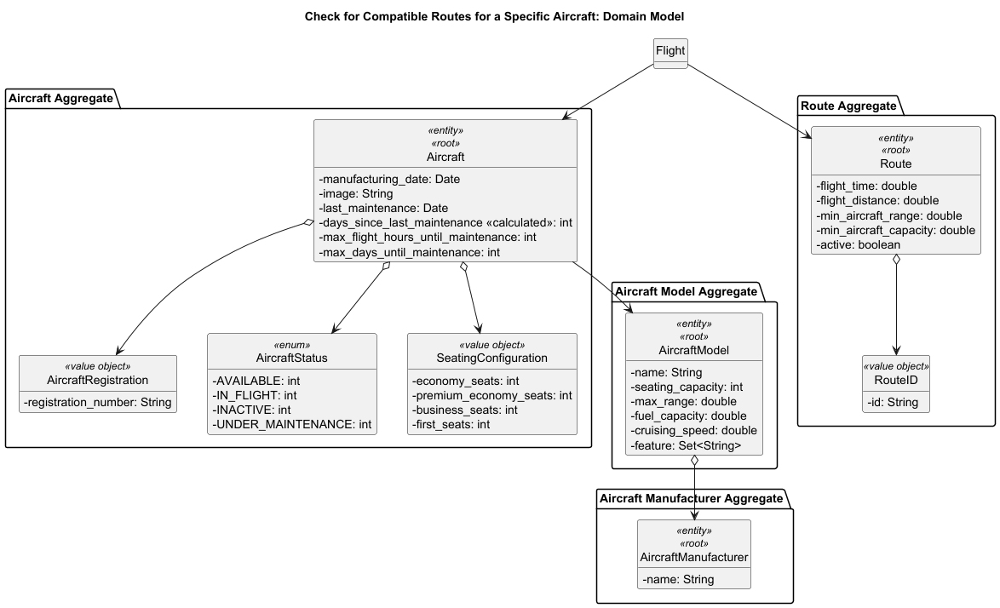
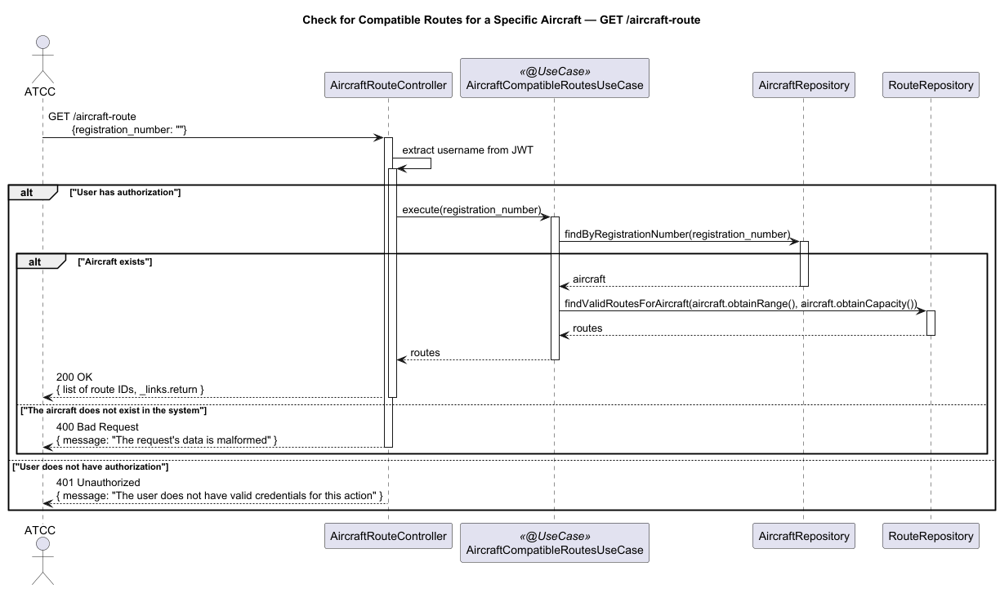

# US203 - Check for Compatible Routes for a Specific Aircraft

## User Story Description

_As an ATCC, I want to view which routes are compatible with a specific aircraft based on its range and capacity. The same airplane model can have different seat configuration, and therefore different capacities._

## Customer Specifications and Clarifications
> Q: A US101 refere que que o Aircraft Model tem uma "seating capacity". Mas a US203 diz: "The same airplane model can have different seat configuration, and therefore different capacities."
> Neste sentido, relativamente à capacidade de passageiros, se diferentes aviões do mesmo modelo podem ter capacidades diferentes (US203), a capacidade de lugares deve ser registada ao nível da Instância da Aeronave (Aircraft) em vez de (ou em adição a) ser registada no Modelo da Aeronave (US101)? Ou devemos criar um Modelo de Aeronave diferente para cada configuração de lugares?
> 
> A: Aviões, mesmo sendo do mesmo modelo, podem ter capacidades diferentes.

> Q: We understand that specific aircrafts of the same model can have different seat configurations. Because of this, the seating capacity will be registered individually for each aircraft.
> However, regarding the creation of the Aircraft Model itself (US101), should the model define a "maximum possible seating capacity"?
> We are wondering if this is needed to prevent data entry errors (e.g.: if an Operator registers a specific aircraft, should the system verify that the entered seats do not exceed the absolute maximum structural limit defined by that aircraft's model? Or should we assume any number entered by the operator is valid?
>
> A: Yes. The seating capacity defined in the Aircraft Model represents the maximum structural capacity. This should be used to validate seating configurations.

## Class Diagram

## Domain Model

## Sequence Diagram

## OpenAPI Specification
The OpenAPI Specification is present in [US203.yaml](US203.yaml)