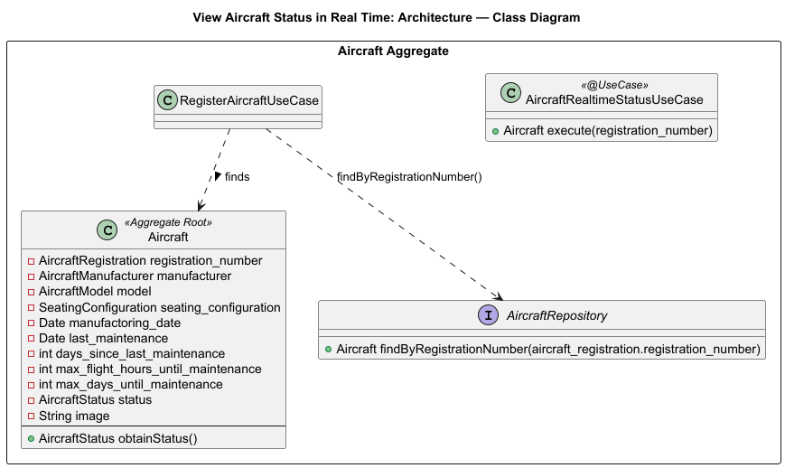
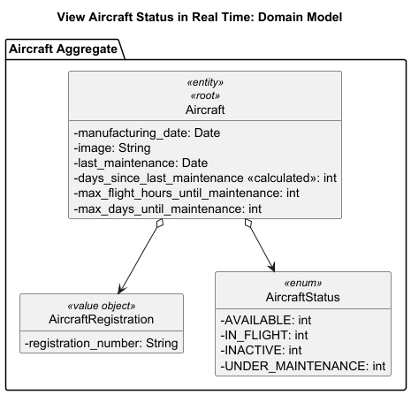
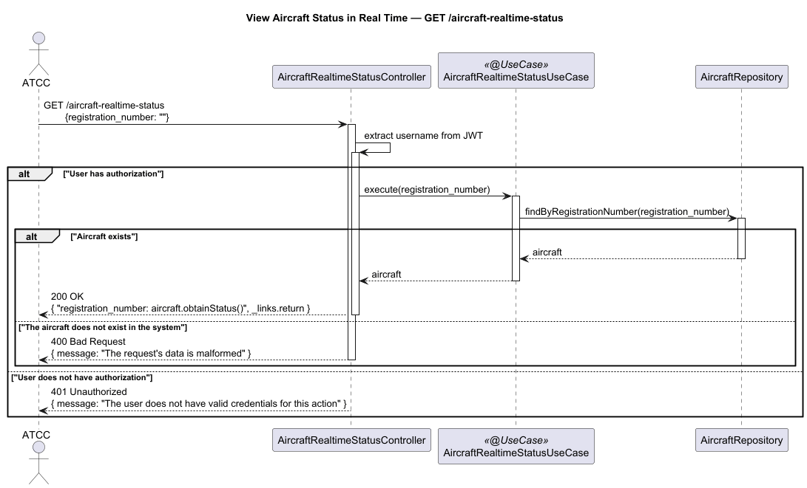

# US205 - View Aircraft Status in Real Time

## User Story Description

_As an ATCC, I want to view real-time aircraft availability status (available, in-flight, under maintenance, inactive)._

## Customer Specifications and Clarifications
> Q: A US205 pede para ver o estado da aeronave em tempo real, incluindo "in-flight". No entanto, não há nenhuma User Story explícita para "iniciar voo" ou "concluir voo".
> Assim, Para a US205, o estado da aeronave pode ser 'in-flight'. Como é que a aeronave transita para este estado e regressa a "available"? Existe alguma US implícita para o registo da partida e chegada de um Scheduled Flight, ou o estado muda automaticamente com base na data/hora do agendamento (US212)?
>
> A: Essas transições serão feitas manualmente e implementadas numa iteração futura do sistema.

## Class Diagram

## Domain Model

## Sequence Diagram

## OpenAPI Specification
The OpenAPI Specification is present in [US205.yaml](US205.yaml)