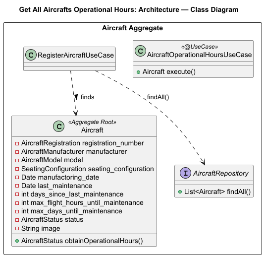
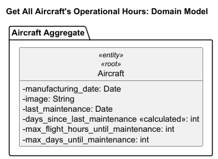
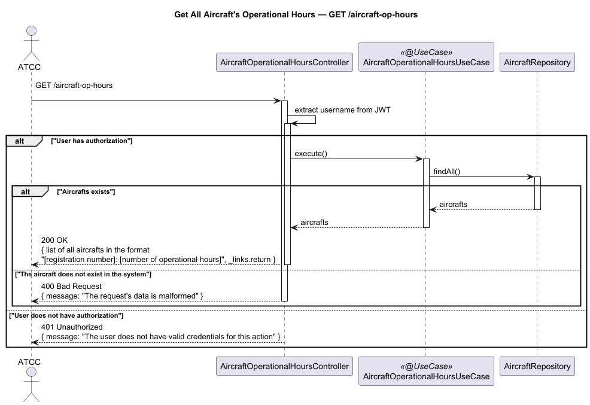

# US206 - Get All Aircraft's Operational Hours

## User Story Description

_As an ATCC, I want to calculate the total operational hours for each aircraft in my fleet._

## Customer Specifications and Clarifications
There were no questions made to the customer regarding this functionality.

## Class Diagram

## Domain Model

## Sequence Diagram

## OpenAPI Specification
The OpenAPI Specification is present in [US206.yaml](US206.yaml)