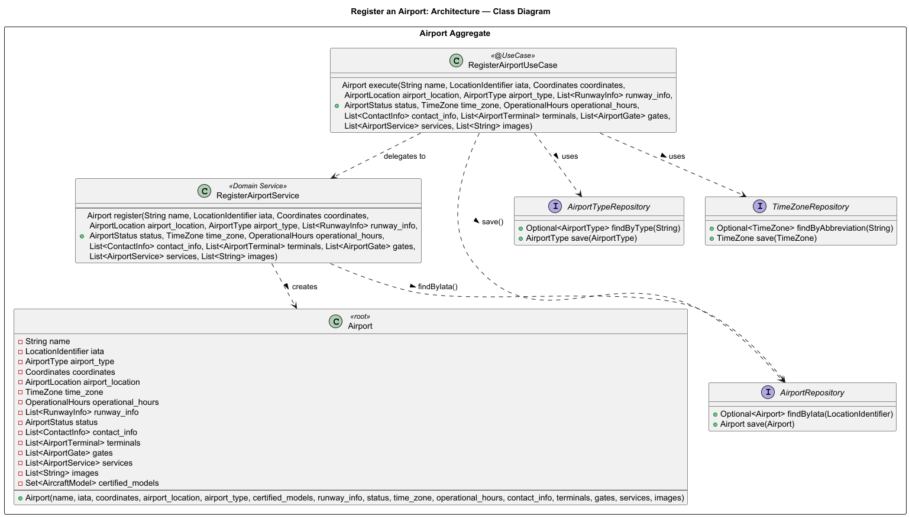

# US106 - Register an Airport

## User Story Description

_As a Backoffice Operator, I want to register an airport with details including IATA code
, name, city, country, timezone, coordinates, and runway information (name, length, orientation, …). in the system._

## Customer Specifications and Clarifications

> -

## Class Diagram

## Domain Model

## Sequence Diagram

## OpenAPI Specification
The OpenAPI Specification is present in [US106.yaml](US106.yaml)