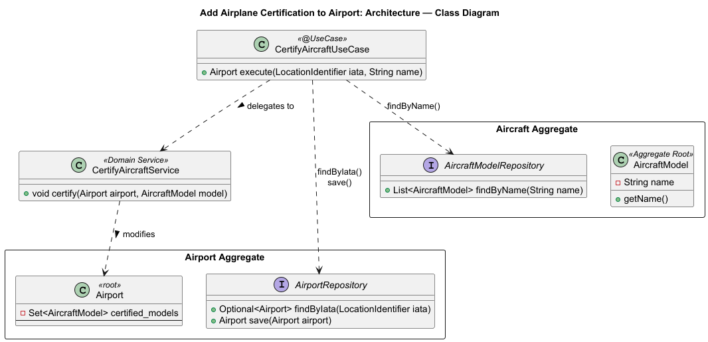
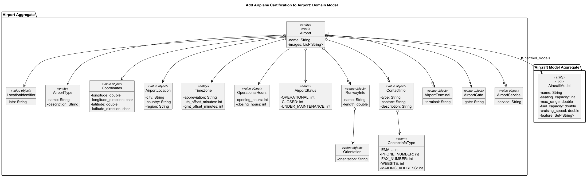
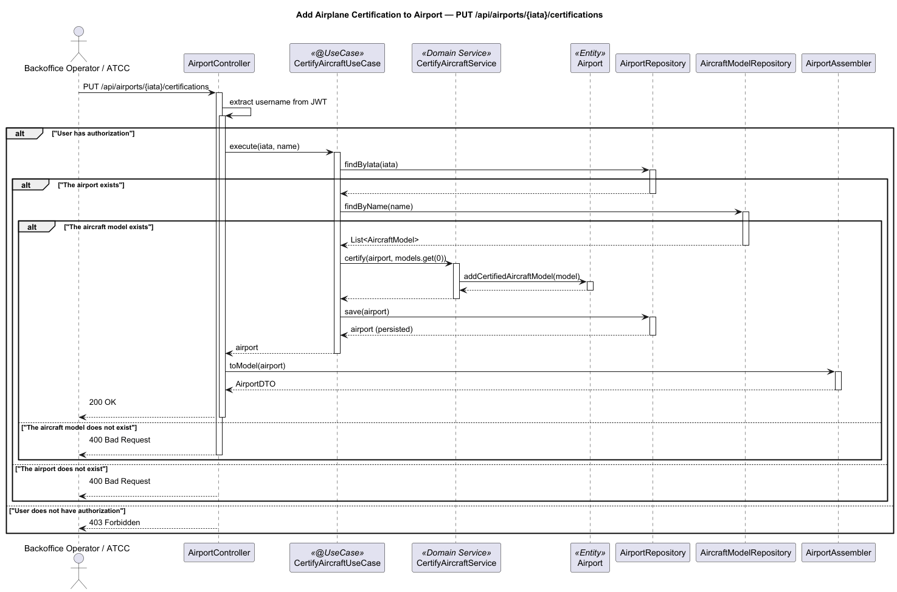

# US106a - Add Airplane Certification to Airport

## User Story Description

_As a Backoffice Operator or ATCC, I want to add an airplain/aircraft model certification to the airport, indicating that a
particular airplane model can fly to/from the airport._

## Customer Specifications and Clarifications

> -

## Class Diagram

## Domain Model

## Sequence Diagram

## OpenAPI Specification
The OpenAPI Specification is present in [US106a.yaml](US106a.yaml)