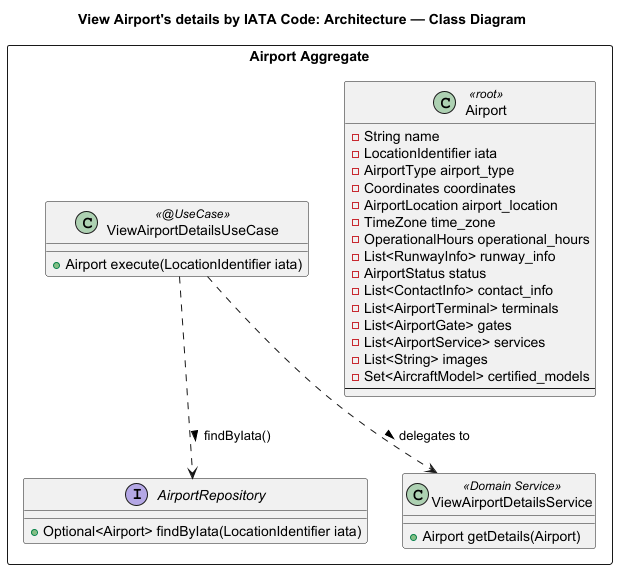
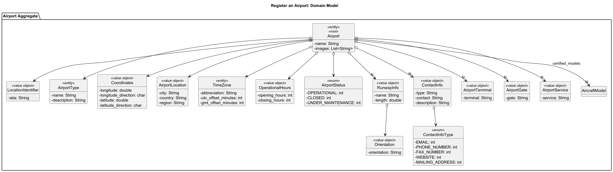
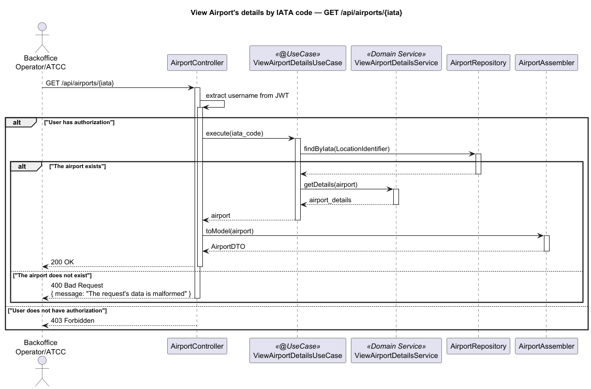

# US107 - View Airport's details by IATA code

## User Story Description

_As an ATCC or Backoffice Operator, I want to view an airport's details given its IATA code._

## Customer Specifications and Clarifications

> -

## Class Diagram

## Domain Model

## Sequence Diagram

## OpenAPI Specification
The OpenAPI Specification is present in [US107.yaml](US107.yaml)