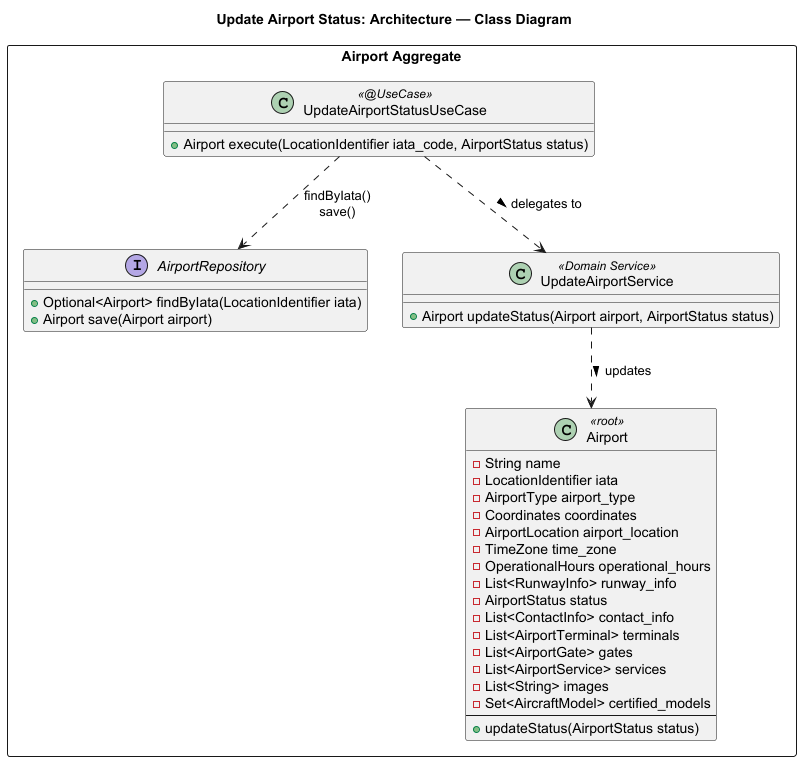

# US109 - Update an Airport's Operational Status

## User Story Description

_As a Backoffice Operator, I want to update an airport's operational status (operational, closed, under maintenance)._

## Customer Specifications and Clarifications

> -

## Class Diagram

## Domain Model

## Sequence Diagram

## OpenAPI Specification
The OpenAPI Specification is present in [US109.yaml](US109.yaml)