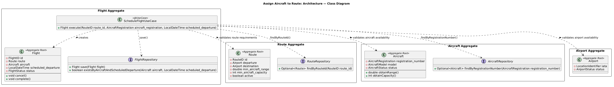
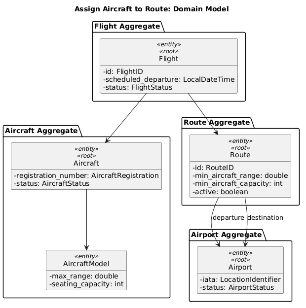
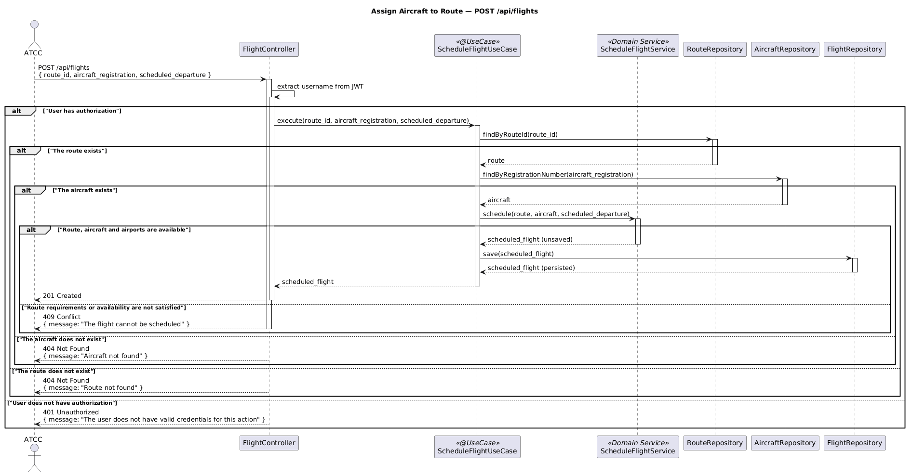

# US212 - Assign Aircraft to Route

## User Story Description

_As an ATCC, I want to assign an aircraft to a route for a specific date and time to create a scheduled flight. These should comply with range requirements, airplane and airport availability._

## Customer Specifications and Clarifications

There were no questions made to the customer regarding this functionality.

## Class Diagram

## Domain Model

## Sequence Diagram

## OpenAPI Specification

The OpenAPI Specification is present in [US212.yaml](US212.yaml)