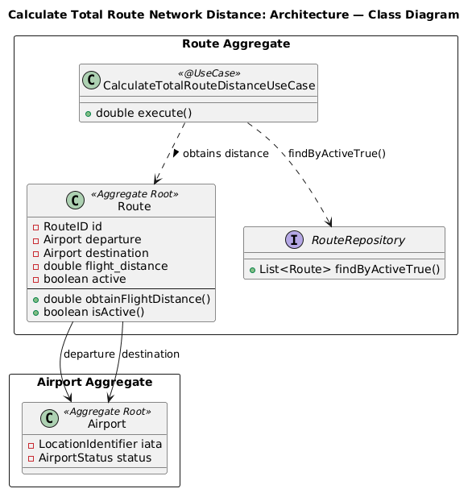
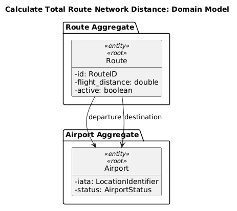
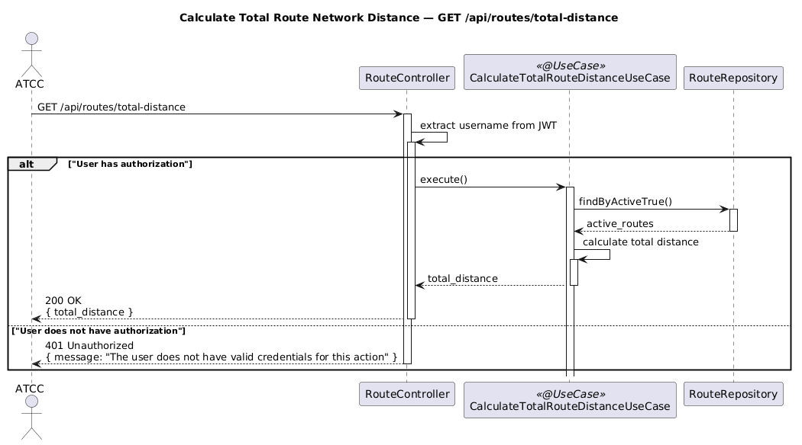

# US215 - Calculate Total Route Network Distance

## User Story Description

_As an ATCC, I want to calculate the total distance covered by all routes in my network._

## Customer Specifications and Clarifications

There were no questions made to the customer regarding this functionality.

## Class Diagram

## Domain Model

## Sequence Diagram

## OpenAPI Specification

The OpenAPI Specification is present in [US215.yaml](US215.yaml)