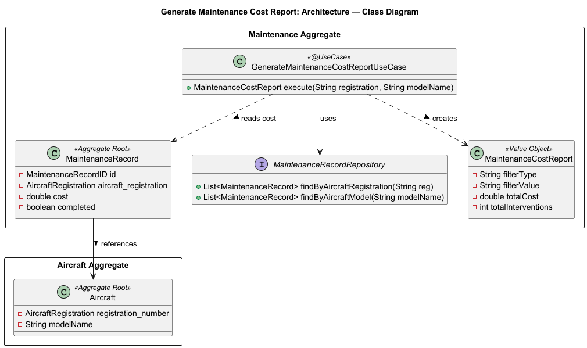
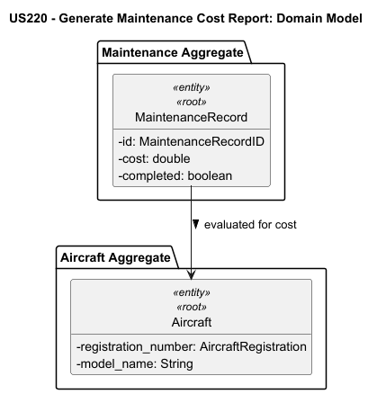
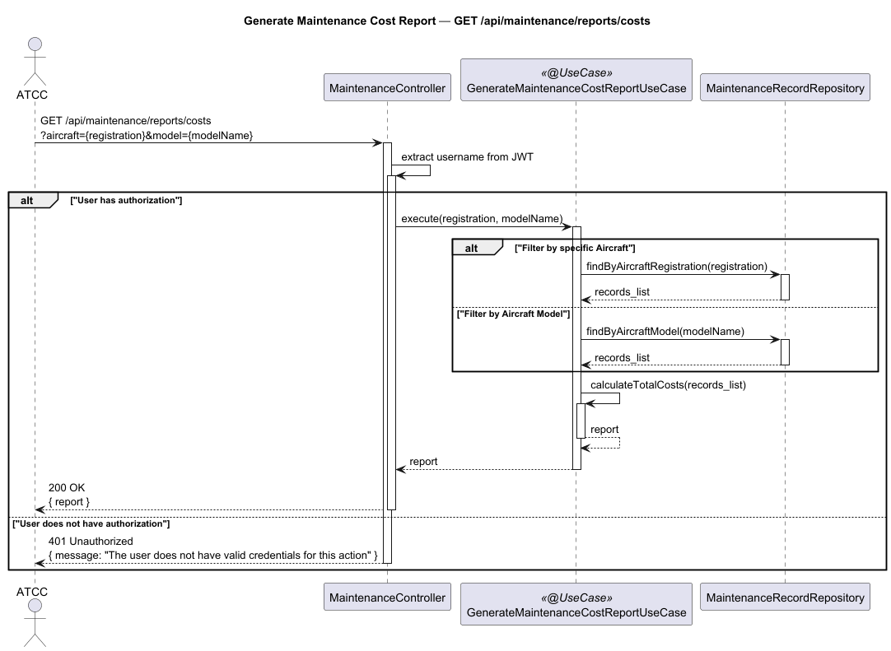

# US220 - Generate Maintenance Cost Reports

## User Story Description

_As an ATCC, I want to generate reports on maintenance costs per aircraft or per aircraft model._

## Customer Specifications and Clarifications
There were no questions made to the customer regarding this functionality.

## Class Diagram

## Domain Model

## Sequence Diagram

## OpenAPI Specification
The OpenAPI Specification is present in [US220.yaml](US220.yaml)