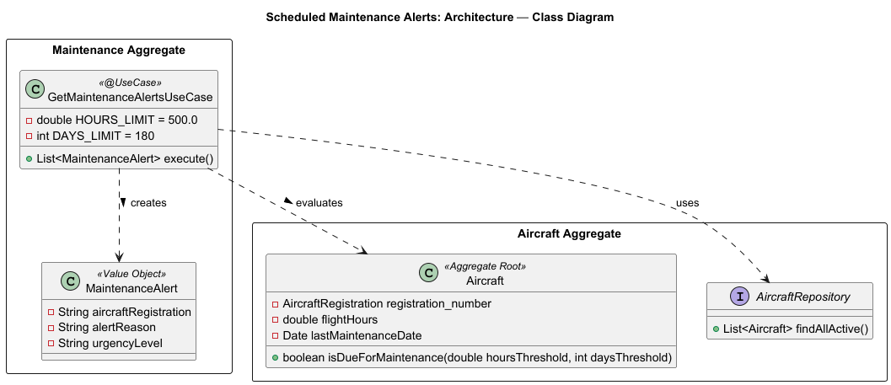
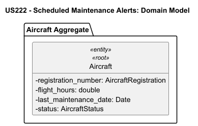
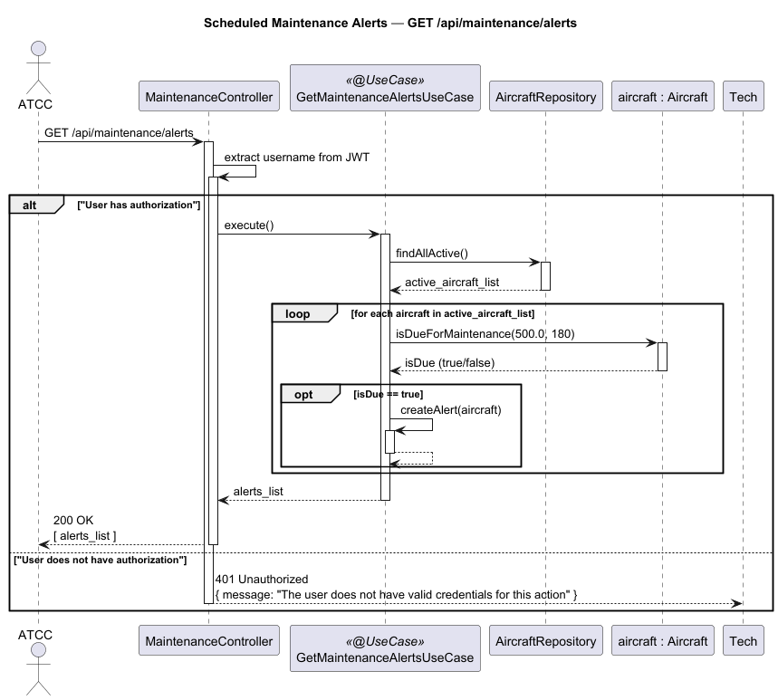

# US222 - Scheduled Maintenance Alerts

## User Story Description

_As an ATCC, I want to receive alerts when aircraft are due for scheduled maintenance based on flight hours or calendar days._

## Customer Specifications and Clarifications
There were no questions made to the customer regarding this functionality.

## Class Diagram

## Domain Model

## Sequence Diagram

## OpenAPI Specification
The OpenAPI Specification is present in [US222.yaml](US222.yaml)